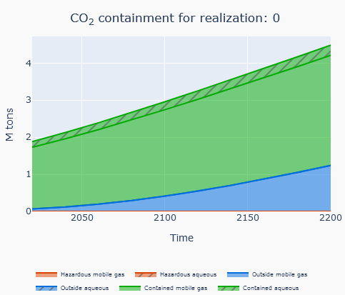

CO2_CONTAINMENT
==============

Calculates the amount of CO\ :sub:`2` inside and outside a given perimeter, and separates the result per formation and phase (gas/dissolved). Output is a table on CSV format.

Input
----------------------------

The script takes the following input:

* grid: Grid (.EGRID) from which maps are generated
* containment_polygon: Polygon that determines the bounds of the containment area. Can use None as input value, defining all as contained.
* outfile: Output filename (CSV file)
* unrst: Path to UNRST file. Will assume same base name as grid if not provided
* init: Path to INIT file. Will assume same base name as grid if not provided
* zonefile: Path to file containing zone information
* compact: Write the output to a single file as compact as possible
* calc_type_input: CO\ :sub:`2` calculation options. See list below.
* hazardous_polygon: Path to file containing zone information
* zonefile: Polygon that determines the bounds of the hazardous area

The most common use of the script is to calculate CO\ :sub:`2` mass. Options for calculation type input:

* "mass": CO\ :sub:`2` mass (kg), the default option
* "volume_extent": CO\ :sub:`2` volume (m\ :sup:`3`), a simple calculation finding the grid cells with some CO\ :sub:`2` and summing the volume of those cells
* "volume_actual": CO\ :sub:`2` volume (m\ :sup:`3`), an attempt to calculate a more precise representative volume of CO\ :sub:`2`
* "volume_actual_simple": CO\ :sub:`2` volume (m\ :sup:`3`), simplified version of "volume_actual"

CSV file example
----------------------------
Example of how the output CSV file is structured:

+------------+-------+-----------------+-----------------+-----------------+-----------------+-----------------+-----------------+-------------------+-----+
| date       | total | total_contained | total_outside   | total_hazardous | total_gas       | total_aqueous   | gas_contained   | aqueous_contained | ... |
+============+=======+=================+=================+=================+=================+=================+=================+===================+=====+
| 2020-01-01 |       |                 |                 |                 |                 |                 |                 |                   |     |
+------------+-------+-----------------+-----------------+-----------------+-----------------+-----------------+-----------------+-------------------+-----+
| 2060-01-01 |       |                 |                 |                 |                 |                 |                 |                   |     |
+------------+-------+-----------------+-----------------+-----------------+-----------------+-----------------+-----------------+-------------------+-----+
| 2100-01-01 |       |                 |                 |                 |                 |                 |                 |                   |     |
+------------+-------+-----------------+-----------------+-----------------+-----------------+-----------------+-----------------+-------------------+-----+

   Example plot of CO\ :sub:`2` mass made from a CO\ :sub:`2` containment output CSV file
