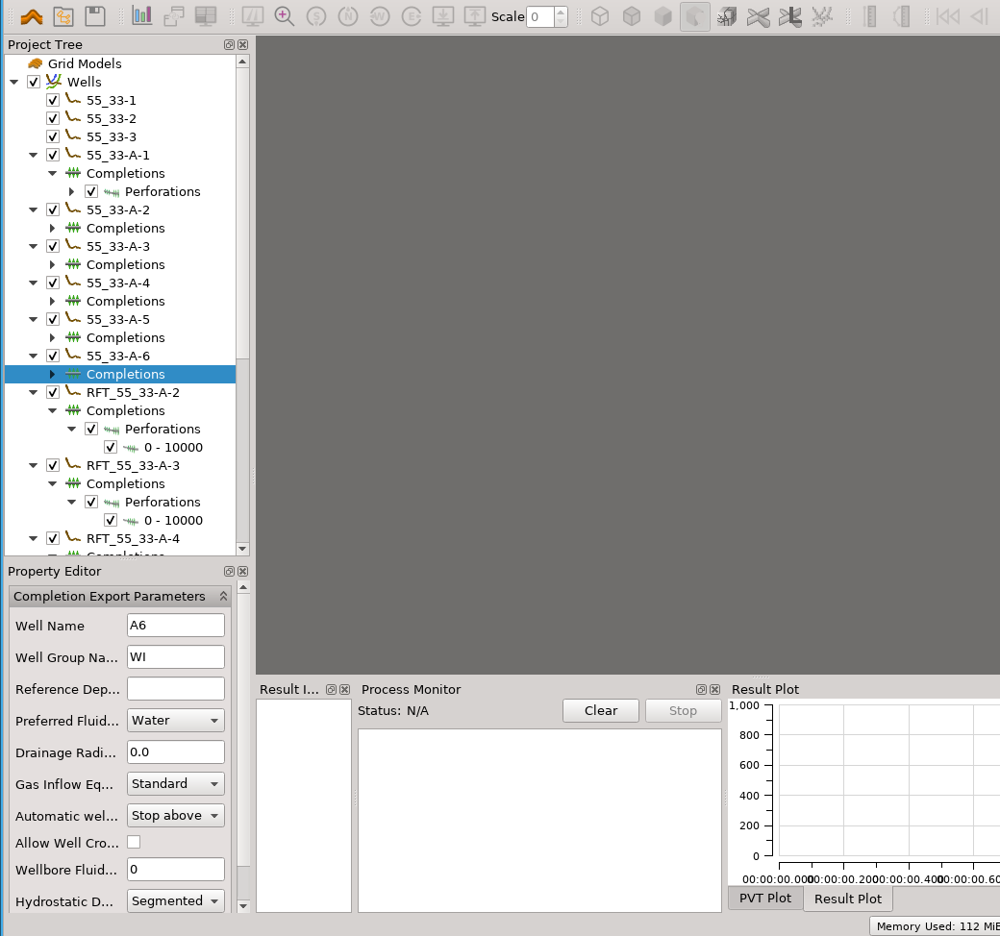

RI_WELLMOD
===========

``ri_wellmod`` is a command line utility to generate Eclipse well model definitions
(WELSPECS/WELSPECL, COMPDAT/COMPDATL, WELSEGS, COMPSEGS) using ResInsight. The script 
takes as input a ResInsight project with wells and completions defined, in addition to 
an Eclipse case (either an initialized case or an input case with grid and PERMX|Y|Z 
and NTG defined in the GRDECL format).

.. note:: Well names specified as command line arguments are assumed to refer to the 
   Eclipse well names, i.e., the completion export names as defined in the ResInsight 
   wells project.

Examples
--------

Example 1
^^^^^^^^^^^

To create well definitions in a file with the default name ``welldefs.sch``::

    > ri_wellmod.py wells.rsp DROGON-0 

Here ``DROGON-0`` is an initialized Eclipse case (i.e., the files DROGON-0.INIT and 
DROGON-0.EGRID/DROGON-0.GRID exist), and wells.rsp is a ResInsight project with wells
and completions defined:

   Example ResInsight project with wells for the Drogon case

Example 2
^^^^^^^^^

By default multi-segment well definitions are not created, but may be requested for 
some or all wells using a command-line argument. E.g., to add MSW data for the well
``A44`` and any wells starting with ``C``::

    > ri_wellmod.py wells.rsp DROGON-0 --msw_wells A4,C*

Example 3
^^^^^^^^^

Instead of using an initialized Eclipse case an input GRDECL case may be used. To 
create meaningful connection factors PERMX/PERMY/PERMZ and NTG (if non-unit) must 
be specified, either in the GRDECL file or in separate files, as in this exapmle::

    > ri_wellmod.py wells.rsp ../include/grid/drogon.grid.grdecl \
      --property_files ../include/grid/drogon.perm.grdecl ../include/grid/drogon.ntg.grdecl 

Syntax
------

.. argparse::
   :module: mypy.ri_wellmod.ri_wellmod
   :func: _build_argument_parser
   :prog: ri_wellmod

See explanation above.

.. warning:: Always QC results of a script: The user is responsible for the
	     output of a script.
