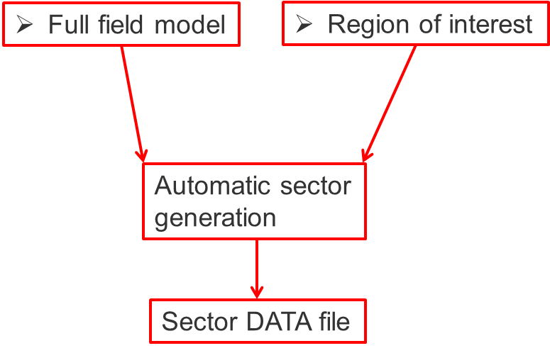

SECTOR2FLUXNUM
==============

``sector2fluxnum`` is a command line utility to generate sector models in Eclipse
using the FLUX functionality

Syntax
------

.. argparse::
   :module: subscript.sector2fluxnum.sector2fluxnum
   :func: get_parser
   :prog: sector2fluxnum
